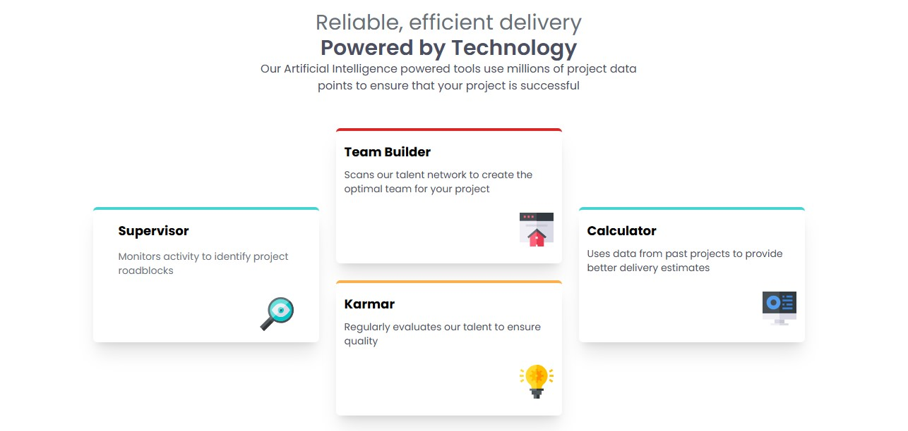

# Frontend Mentor - Four Card Feature Section Solution

This is a solution to the [Four Card Feature Section challenge on Frontend Mentor](https://www.frontendmentor.io/challenges/four-card-feature-section-weK1eFYK). Frontend Mentor challenges help you improve your coding skills by building realistic projects.

## Table of Contents

* [Overview](#overview)

  * [The Challenge](#the-challenge)
  * [Screenshot](#screenshot)
  * [Links](#links)
* [My Process](#my-process)

  * [Built With](#built-with)
  * [What I Learned](#what-i-learned)
  * [Continued Development](#continued-development)
  * [Useful Resources](#useful-resources)
* [Author](#author)

## Overview

### The Challenge

Users should be able to:

* View the optimal layout for the site depending on their device's screen size

### Screenshot



### Links

* Solution URL: [https://github.com/hamzatchiche/four-card-feature](https://github.com/hamzatchiche/four-card-feature)
* Live Site URL: [https://hamzatchiche.github.io/four-card-feature](https://hamzatchiche.github.io/four-card-feature)

## My Process

### Built With

* Semantic HTML5 markup
* Tailwind CSS
* Custom CSS variables
* Flexbox
* CSS Grid
* Mobile-first workflow
* GSAP (GreenSock Animation Platform)

### What I Learned

This challenge helped me improve my responsive layout skills using Tailwind CSS and practice the utility-first approach. I also integrated GSAP animations for the first time, which allowed me to animate the headings and cards with smooth transitions.

```js
let tl = gsap.timeline({
  defaults: { duration: 1.3, ease: "power3.out", opacity: 0 },
});

// Animate heading and cards
```

### Continued Development

I would like to explore more complex GSAP animations and focus on improving accessibility features such as keyboard navigation and ARIA roles.

### Useful Resources

* [Tailwind CSS Documentation](https://tailwindcss.com/docs) - Great reference for utility classes
* [GSAP Documentation](https://greensock.com/gsap/) - Helped me animate elements smoothly
* [Frontend Mentor Community](https://www.frontendmentor.io/community) - Good place to find help and inspiration

## Author

* Frontend Mentor - [@hamzatchiche](https://www.frontendmentor.io/profile/hamzatchiche)
* GitHub - [@hamzatchiche](https://github.com/hamzatchiche)
